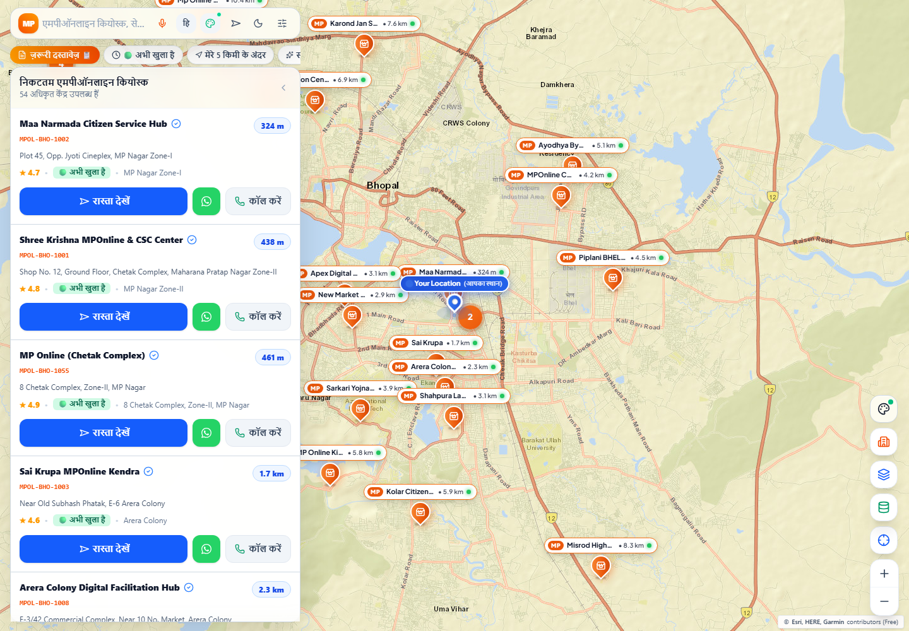
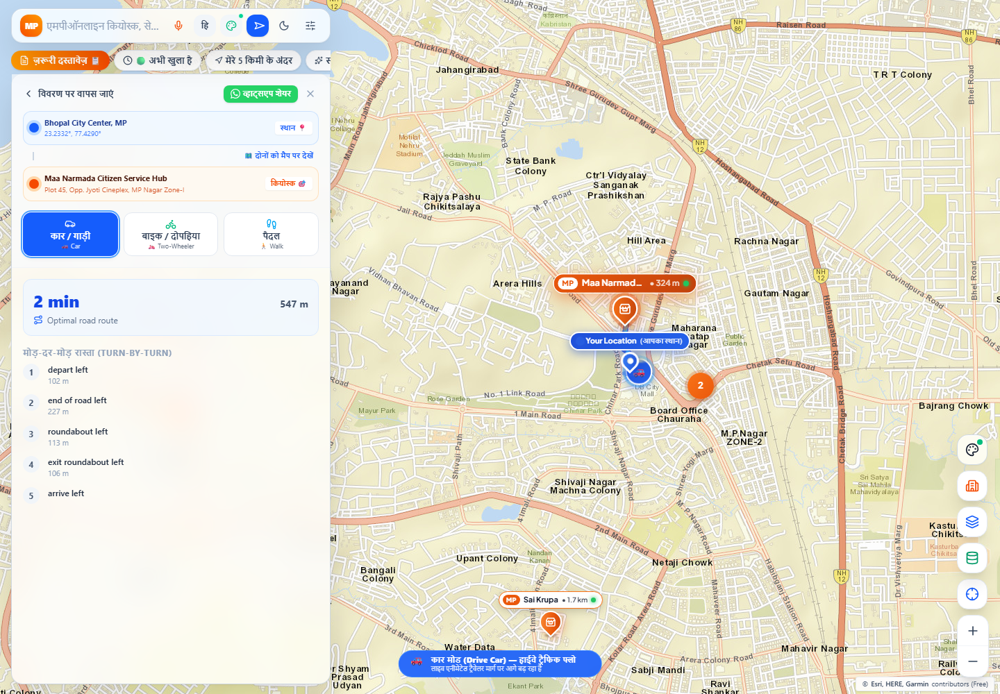

# MPOnline Kiosk Navigator

An interactive, bilingual map application for finding MPOnline kiosk centres across Madhya Pradesh. Search nearby centres, compare map styles, get directions, and prepare a map area for low-connectivity use.

## Highlights

- Browse and search kiosk centres by name, code, locality, city, operator, or service.
- Filter centres by availability, verification, CSC authorisation, rating, service, city, and distance.
- Get route guidance with driving, two-wheeler, and walking modes.
- Switch between Esri Streets, OpenStreetMap, HOT, OpenTopoMap, and satellite imagery.
- Cache tiles for the current viewport and selected map provider for offline use.
- Use Hindi or English, dark mode, and five interface themes.
- View document checklists and estimated service rates before visiting a centre.

## Screenshots

| Map explorer | Directions |
| --- | --- |
|  |  |

## Technology

- React 19 and TypeScript
- Vite and Tailwind CSS
- Leaflet and Supercluster
- IndexedDB for offline map tiles
- OSRM for route calculation
- Vitest and Testing Library

## Run locally

**Prerequisites:** Node.js 20 or newer and npm.

```bash
npm install
npm run dev
```

Open the URL printed by Vite. The development server is available on all network interfaces for testing on another device.

## Quality checks

```bash
npm run lint
npm exec vitest run
npm run build
```

## Offline maps

Open the offline cache manager from the map controls and select **Download Current View Offline**. Tiles are stored separately for each map provider, so the saved map always matches the style selected when it was downloaded. The result panel reports cached, downloaded, and failed tiles rather than treating a partial download as complete.

## Data note

Kiosk details included in this repository are demonstration data. Confirm centre availability, service charges, operating hours, and document requirements through official MPOnline channels before visiting.

## Repository

[github.com/Project-file2002/MPOnline-centre-map](https://github.com/Project-file2002/MPOnline-centre-map)
